# Spring-Boot-MVC-Auth0-Starter

## Contents

This project template contains an extended setup for a web development project based on:

*   Spring Boot 2
*   Thymeleaf 3
*   Kotlin
*   Maven

The project already contains a working integration of Auth0 for secure user management and is prepared for easy deployment on [Heroku](https://www.heroku.com). A sample configuration for an [Azure Build Pipeline](https://azure.microsoft.com/en-en/services/devops/pipelines/) is contained as well.

## Getting started using Github, Heroku and Auth0

Starting your project based on this template and getting it running on Heroku will take you 15 to 30 minutes - depending on whether you have accounts for these services or not. Let's go through this process step by step.

1. Click on "Use this template" to create a repository for your project on Github. 
   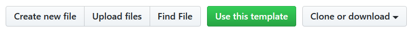
2. You can now enter the data for your new project repository. Click "Create repository from template" to finish the process.
   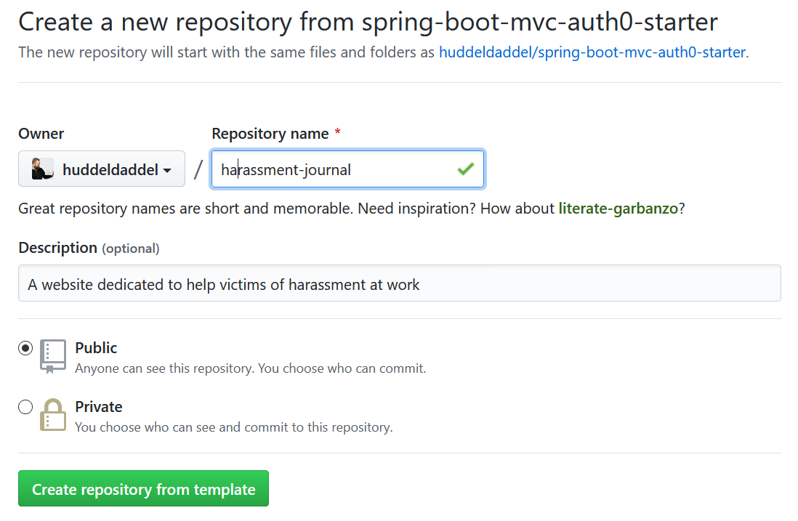
3. Head over to [Heroku](https://heroku.com) and sign up / login. Now create a new app. Pick a good name for it - it will later be part of your URL.  
   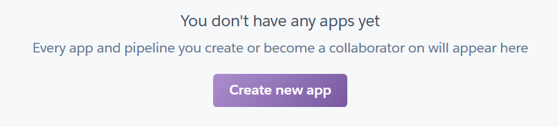
4. Now connect your app to your repository on Github. 
   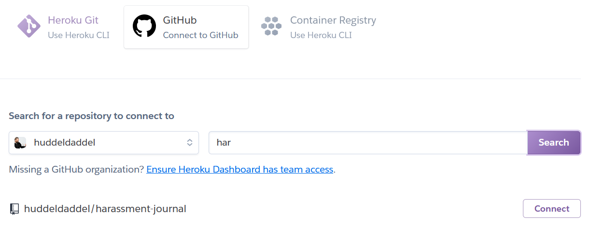
   You might want to activate the automatic deployment of the master branch. Every commit that you do on the master branch will then be compiled and deployed automatically.
5. If you click on "Overview" you will see that we have no addons configured so far. 
   Let's change that by adding the free tier if the "Heroku Postgres" addon. It attaches a PostgreSQL relational database to your app. The configuration is handled automatically. The free tier is very limited in it's capacity - nut should be sufficient for development.
   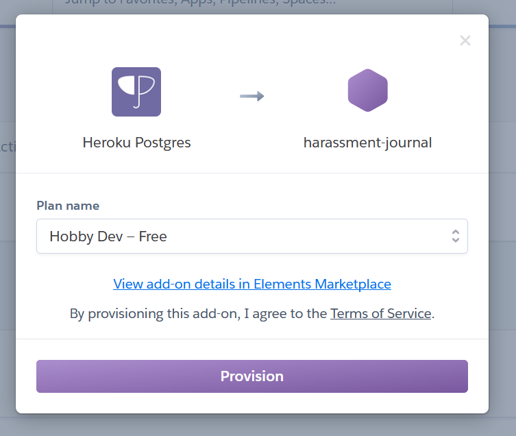.  
   You might want to add Papertrail for handling the log output of your application.
6. Now click on "Settings" and configure the Buildpack. Select "heroku/java".
   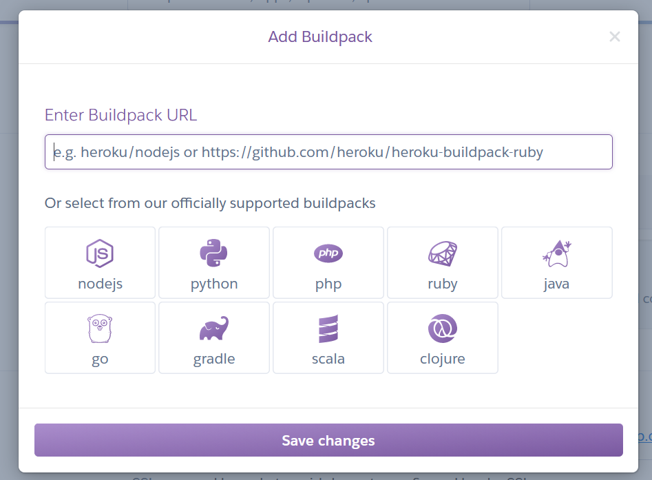
7. Now scroll down to the section "Domains and certificates". Here you'll find the domain of your application. Copy that value - we'll need it in the next step.
   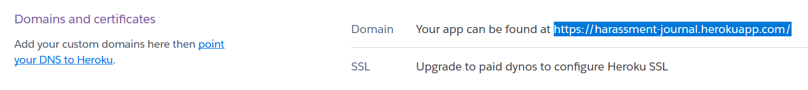
8. Clone your repository and open it in an editor of your choice. Open 
   `src\main\resources\application-production.properties`. Change the value for `com.auth0.callback`
   to be the domain of your app (see last step) ending with `/callback`. Now commit and push your changes.
9. Now head over to [Auth0](https://auth0.com) and create a new app for your project. Pick a name and select "Regular Web Application" as type.  
   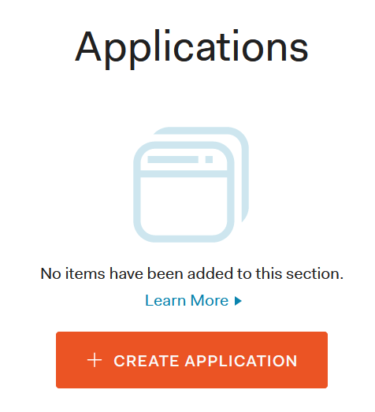.
10. Configure the URLs that are allowed for callbacks. During development 
    `http://localhost:3000/callback` will be used. The callback of your app on Heroku will use the
    value you have configured as `com.auth0.callback`.
11. Now configure the URLs that are allowed for logouts. 
    Use `http://localhost:3000` for development and you app domain on Heroku.
12. Copy the credentials (`Domain`, `Client ID`, `Client Secret`) of your Auth0 application.
    You can find them on the settings tab. Now head over to Heroku, open the settings of your app 
    and reveal the config vars.
13. Update the configuration. Add the three settings that start with `AUTH0` and set the values 
    that you found in the last step.
    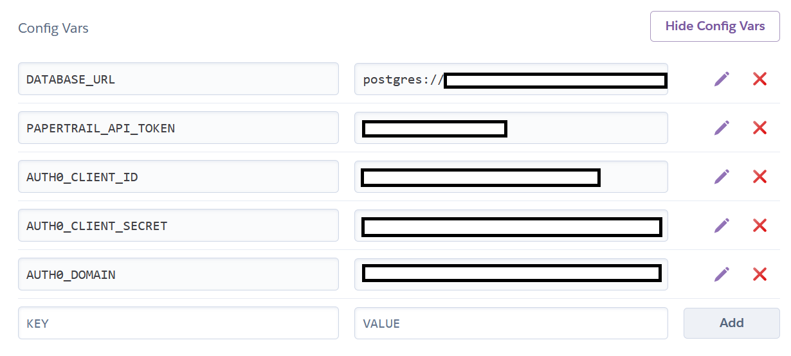
14. Finally - you've made it! Yeah! Go to the Deploy tab on Heroku and start a deployment of the
    master branch manually. Once the application has been compiled the success notification will be shown. Click on "View" to open your application in the browser.
    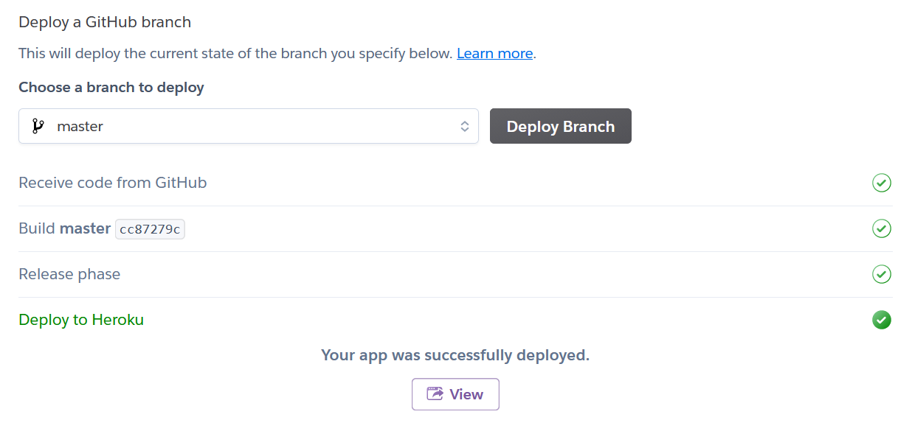
15. Your browser now displays the (unprotected) success page. To test the Auth0 integration just
    navigate to `/protected/home`.  
    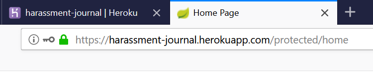  
    You should be redirected to Auth0. Use the dialog to sign-up for a new account. Once you're done you'll be forwarded to the protected section of your application.  
    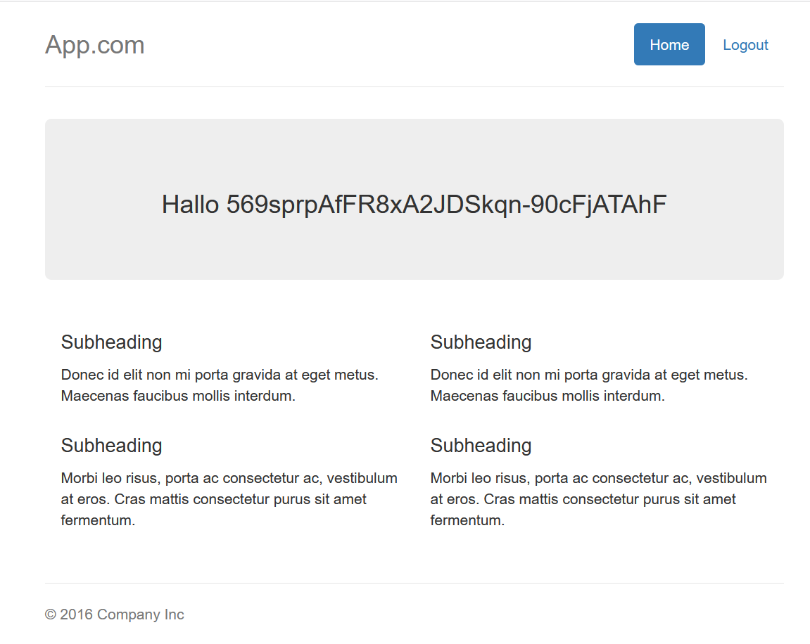

## Getting started locally

1.   Clone the repository
2.   Install a database (e.g. PostgreSQL)
3.   Perform step 9 to 13 explained above to create and configure your Auth0 application. No need to worry about the Heroku URLs there - just set the localhost configuration and leave the rest empty.
4.   Create `application-default.properties` and copy the content of 
     `application-production.properties` into it. Adjust the Auth0 settings to the values that have
     been displayed at the end of the Auth0 project setup. Adjust the datasource settings for usage
     of your local database.
